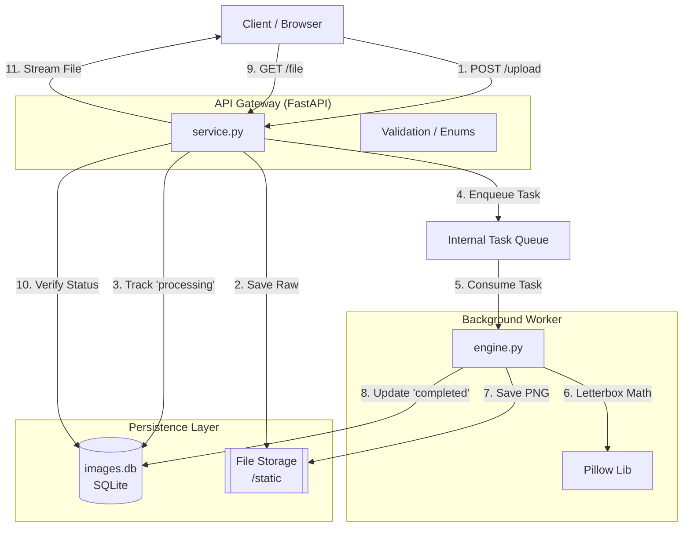

# Pro Thumbnail API Service

A robust, asynchronous microservice for production-grade image resizing and thumbnail generation. Built with **FastAPI**, **Pillow**, and **SQLite**.

---

## 1. Overview
This service provides a scalable solution for managing image assets and generating consistent, high-quality thumbnails. It addresses key production challenges, including maintaining aspect ratios without distortion (via Letterboxing), handling large file uploads without blocking the API (via BackgroundTasks), and ensuring data persistence.


## 2. System Architecture

The service follows a **Producer-Consumer** pattern. The API accepts requests and produces tasks into an internal queue, which the Background Worker consumes to perform I/O and CPU-bound image processing.




---

## 3. Image Processing Logic: Letterboxing
To ensure a consistent UI, the service implements **Letterboxing** (adding black bars) rather than stretching or cropping.

1.  **Canvas Creation:** A new RGB image (the "canvas") is created at the exact target dimensions (e.g., 512x512) with a black background.
2.  **Proportional Scaling:** The source image is scaled until its longest side hits the canvas boundary, preserving the original aspect ratio.
3.  **Centering:** The scaled image is mathematically centered on the canvas, ensuring that "extra" space is distributed evenly as black bars.

---

## 4. Execution & Build Instructions

### Prerequisites
* Python 3.10+
* pip

### Installation
1. **Clone the repository:**
   ```bash
   git clone <your-repo-url>
   cd thumbnail-api-service```
   
   
## 4. Execution & Build Instructions
### Prerequisites
* Python 3.11+
* pip

### Installation
1. **Clone the repository:**

```bash
git clone <your-repo-url>
cd thumbnail-api-service
```
Install dependencies:

```bash
pip install -r requirements.txt
```
Initialize directories:

```bash
mkdir -p static/uploads static/thumbs
```
### Running the Application
Start the FastAPI server using Uvicorn:

```bash
python -m uvicorn src.api.service:app --host 0.0.0.0 --port 8000 --reload
```
The API will be available at http://localhost:8000. You can view the interactive Swagger documentation at http://localhost:8000/docs.

## 5. Testing Instructions
The project includes a suite of 40 tests (30 Unit, 10 Integration) covering every layer of the stack to ensure stability and prevent regressions.

### Set Python Path
To ensure imports resolve correctly in your terminal environment, run:

```bash
export PYTHONPATH=$PYTHONPATH:.
```

### Run All Tests

```bash
pytest tst/
```
### Run Unit Tests Only (Fully Mocked)
These tests verify logical correctness and edge-case handling without requiring disk or database access.

```bash
pytest tst/api/test_models.py tst/api/test_service.py tst/resizer/test_engine.py
```

### Run Integration Tests (Real DB and File System)
These tests verify the full end-to-end flow, including background task execution, file persistence on disk, and SQLite record updates.

```bash
pytest tst/integ/test_integ.py
```

## 6. CI/CD
**A GitHub Actions workflow (.github/workflows/main.yml) is configured to run the full test suite automatically on every push.**

The pipeline handles:

* Environment Configuration: Setting the correct PYTHONPATH.

* Dependency Installation: Installing requirements in a clean virtual environment.

* Database Initialization: Ensuring the SQLite schema is initialized before testing.

* Automated Testing: All tests must pass in order for workflow to succeed.

